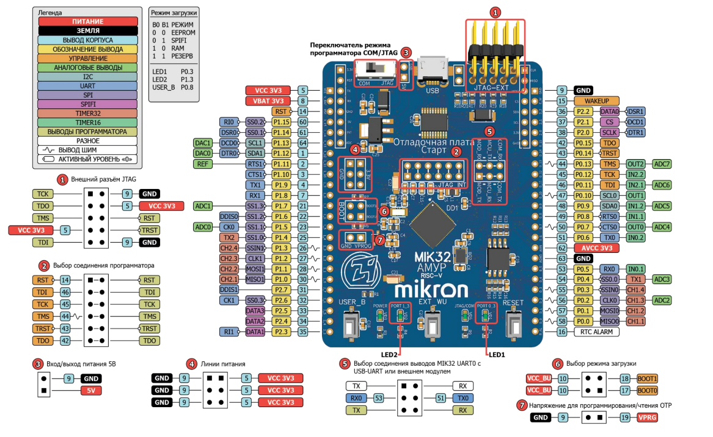
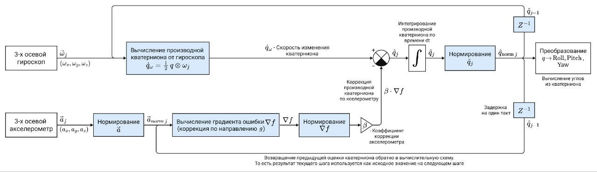
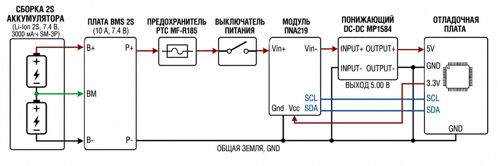

# Aircraft Navigation System

Бортовая прошивка системы сбора и передачи телеметрии: инерциальные параметры, GPS-координаты, барометрия и параметры электропитания. Данные уходят на наземную станцию по UART в бинарном протоколе.

**Платформа:** микроконтроллер MIK32 (плата Старт), PlatformIO, framework-mik32v2-sdk.

**Наземная станция:** [Telemetry-Monitor](https://github.com/porapospat/Telemetry-Monitor) — десктопное приложение на WinForms (.NET Framework 4.8), которое принимает кадры по COM-порту, строит графики, отображает карту GPS и авиационные индикаторы.

## Содержание

- [Назначение](#назначение)
- [Аппаратная часть](#аппаратная-часть)
- [Оценка ориентации (фильтр Маджвика)](#оценка-ориентации-фильтр-маджвика)
- [Энергосистема](#энергосистема)
- [Протокол обмена](#протокол-обмена)
- [Структура проекта](#структура-проекта)
- [Дополнительная информация](#дополнительная-информация)

## Назначение

Прошивка опрашивает датчики на борту, обрабатывает измерения и формирует телеметрические кадры для наземного мониторинга.

| Модуль | Задача |
|--------|--------|
| MPU6050 + Madgwick (AHRS) | Крен, тангаж, курс |
| NEO-M8N + minmea | Разбор NMEA GGA: широта, долгота, высота |
| BMP280 | Давление и температура |
| INA219 | Напряжение шины, ток, мощность |

Обмен с наземной станцией — **односторонний** (борд → ПК).

## Аппаратная часть

Плата разработки и назначение выводов:

<div align="center">
  
  <br>
  <em>Назначение выводов платы Старт</em>
</div>
<br>

## Датчики

| Модуль | Интерфейс | Назначение |
|--------|-----------|------------|
| MPU6050 | I2C0 | Акселерометр / гироскоп |
| BMP280 | I2C1 | Давление, температура |
| INA219 (CJMCU-219) | I2C1 | Ток, напряжение, мощность |
| NEO-M8N | USART0 (RX) | GPS / ГЛОНАСС, NMEA |

## Оценка ориентации (фильтр Маджвика)

Крен и тангаж рассчитываются алгоритмом AHRS на основе **фильтра Маджвика** (`ahrsimu.c`). Он использует кватернионное представление ориентации и корректирует оценку, полученную по гироскопу, за счет данных акселерометра, а при наличии магнитометра — также магнитного поля Земли. Особенность фильтра состоит в использовании **градиентного метода** для минимизации ошибки между измеренным и расчетным направлением опорных векторов. Алгоритм имеет сравнительно низкую вычислительную сложность и небольшое число настраиваемых параметров, поэтому хорошо подходит для реализации на микроконтроллерных платформах.  

Итак, внутри фильтра ориентация хранится в виде **кватерниона**; на выходе в телеметрию передаются углы Эйлера (крен, тангаж). Курс (рыскание) в текущей прошивке рассчитывается интегрированием угловой скорости гироскопа и в оценку Madgwick не входит.

<div align="center">
  
  <br>
  <em>Функциональная схема фильтра Маджвика</em>
</div>
<br>

## Энергосистема

Питание строится вокруг Li-Ion 2S, BMS и DC-DC преобразователя. Мониторинг параметров питания выполняется микросхемой INA219, подключенной к микроконтроллеру MIK32 по шине I2C. Датчик измеряет напряжение на шине, ток через шунт и позволяет рассчитывать потребляемую мощность. Для стенда используется режим измерения, согласованный с номиналом силовой цепи сборки 2S (7,4 В) и ожидаемым током потребления маломощного лабораторного комплекса.

<div align="center">
  
  <br>
  <em>Структурная схема энергосистемы</em>
</div>
<br>


## Протокол обмена

Направление: **микроконтроллер → Telemetry-Monitor** (UART). Кадр с преамбулой и **CRC16 Modbus** по полю `DATA`.

**Формат кадра:**

```
[0x7E][0x7B][ID][LEN][DATA …][CRC_L][CRC_H]
```

Заголовок в прошивке задан как `MSG_HEADER = 0x7B7E` (little-endian на шине: сначала `0x7E`, затем `0x7B`).

| ID пакета | LEN | Источник |  Данные с борта |
|-----------|-----|----------|-----------------|
|   `0x01`  | 36 | MPU6050 | Курс, Крен, Тангаж; Ax, Ay, Az; Gx, Gy, Gz |
|   `0x02`  | 12 | GPS | Широта, долгота, высота |
|   `0x03`  | 8 | BMP280 | Давление, температура |
|   `0x04`  | 12 | INA219 | Напряжение, ток, мощность |

Все поля `DATA` — `float`, порядок байт **little-endian**.

Полная спецификация разбора на стороне ПК — в репозитории [Telemetry-Monitor](https://github.com/porapospat/Telemetry-Monitor) (`docs/protocol.md`). Совместно репозитории `Aircraft Navigation System` и `Telemetry-Monitor` образуют связку **борт ↔ наземная станция** для отладки и демонстрации системы телеметрии.

## Структура проекта

```
MIK32-MPU6050-BMP280-NEO_M8N/
├── src/                    # Исходники прошивки
│   ├── main.c              # Цикл опроса датчиков, обработчик прерываний и вызов функций формирования телеметрии
│   ├── board.c             # Конфигурация тактирования микроконтроллера и базовых системных параметров
│   ├── bus_i2c.c           # Драйвер шин I2C0 / I2C1
│   ├── bus_usart.c         # Драйвер шин UART0 (прием GPS RX), UART1 (передача TX)
│   ├── mpu6050.c           # Драйвер инерциального датчика MPU6050
│   ├── ahrsimu.c           # Фильтр Madgwick: оценка ориентации 
│   ├── bmp280.c            # Драйвер барометра BMP280
│   ├── ina219.c            # Драйвер датчика тока и напряжения INA219
│   ├── gps.c               # Сборка NMEA-предложений
│   ├── ui.c                # Формирование и отправка телеметрических сообщений
│   ├── crc16.c             # Расчёт контрольной суммы CRC16 для проверки целостности сообщений
│   └── mpu_math.c          # Вспомогательная математика для обработки данных инерциального модуля
├── include/                # Заголовки модулей
├── lib/minmea/             # Парсер NMEA предложений (сторонний)
├── docs/images/            # Иллюстрации к документации
└── platformio.ini          # Конфигурация сборки
```

## Дополнительная информация

- [Документация MIK32](https://mik32.ru/)
- [Документация MPU6050](https://static.chipdip.ru/lib/994/DOC012994400.pdf)
- [Документация BMP280](https://static.chipdip.ru/lib/373/DOC043373579.pdf)
- [Документация INA219](https://static.chipdip.ru/lib/924/DOC012924820.pdf)
- [Документация NEO-M8N](https://static.chipdip.ru/lib/458/DOC012458213.pdf)
- [Библиотека minmea](https://github.com/kosma/minmea)
- [Описание протокола NMEA](https://wiki.iarduino.ru/page/NMEA-0183)
- [Madgwick]()